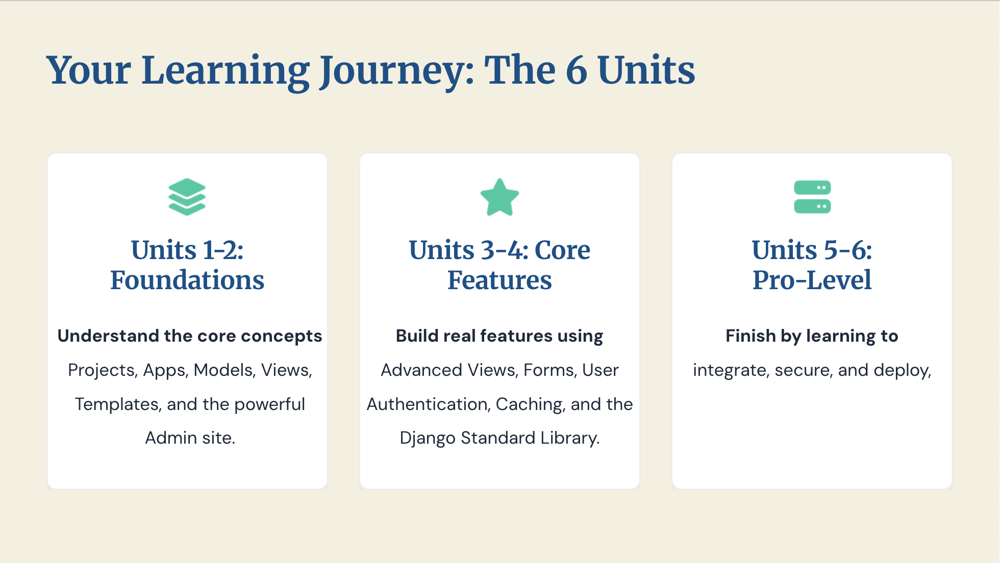
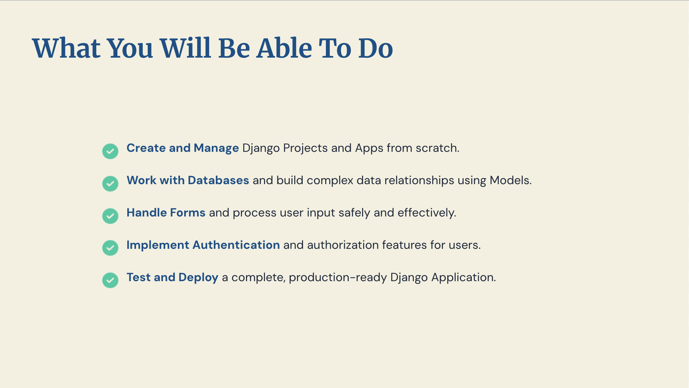
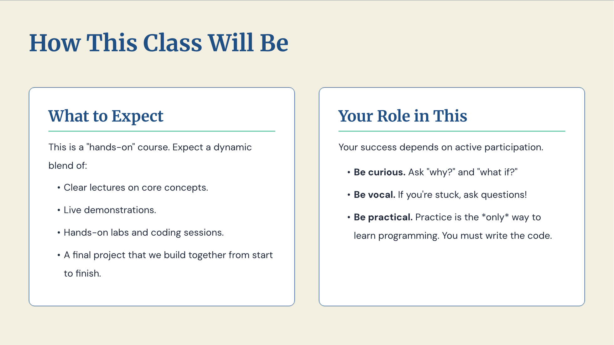
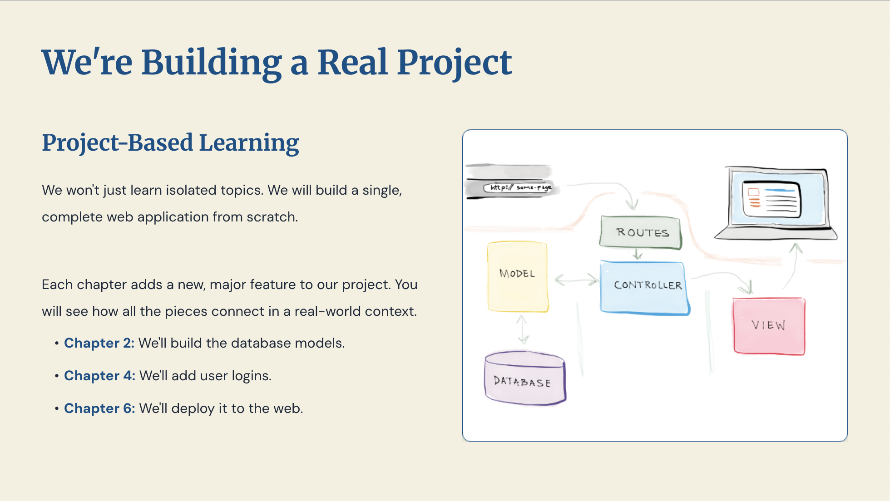
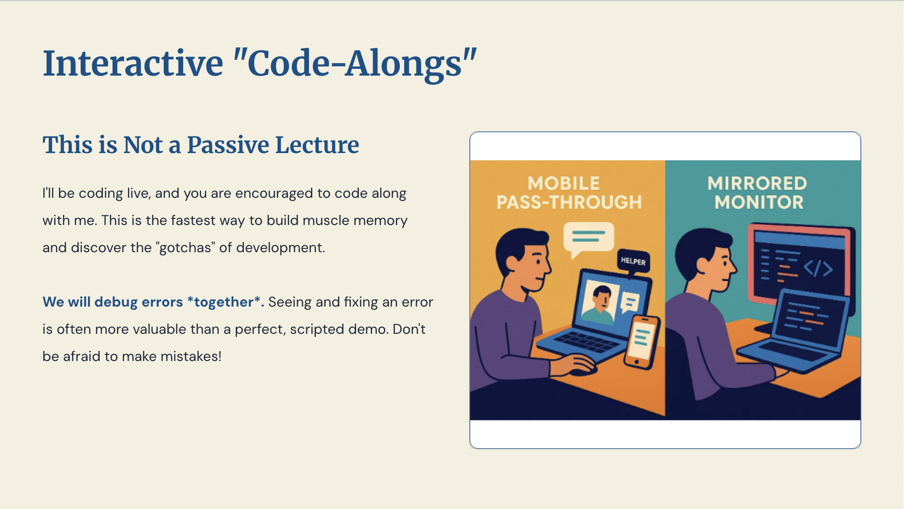
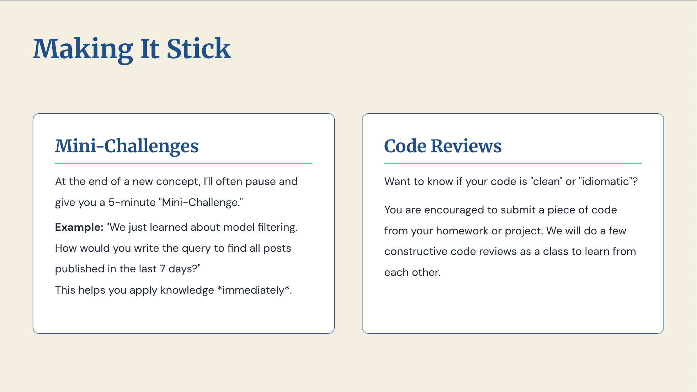
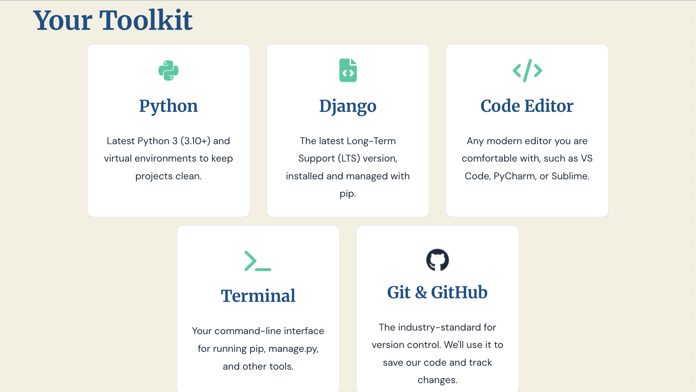
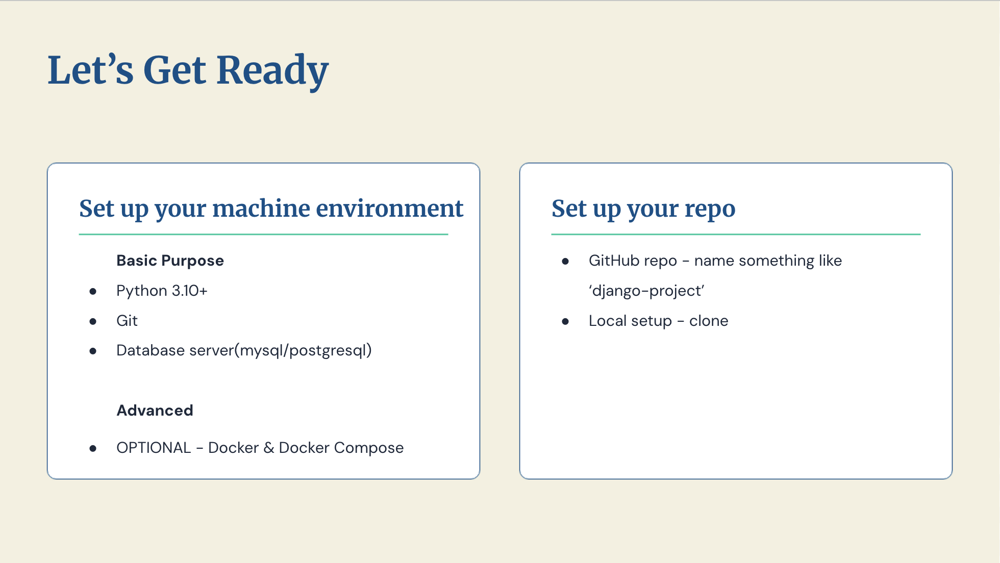

---

## Welcome

**Web Technology (MIT656)** — 45 hours, from never having written a line of Django to deploying a
real, secured, multi-language web application.

Every unit comes in two forms:

- **Class Slides** — what we work through together: numbered, paced, with checkpoints
- **Topic Notes** — reference material for when you are stuck at 11pm and need the exact syntax

Start with the slides. Return to the notes.

→ [Unit 1 — Class Slides](unit-1/slides.md)

---

## Why Learn Web Development?

Almost everything an organisation does now happens partly through a browser. That is why demand has
outstripped supply for two decades straight.

- **In demand** — portable, remote-friendly, and priced accordingly
- **Shortest path from idea to users** — think of it on Tuesday, strangers use it by the weekend
- **The ground moves** — which is exactly why fundamentals beat any single tool

Learn how a request becomes a response and you can pick up the next framework in a week.

---

## Why a Framework?

You *can* build a web application with nothing but Python's standard library. People did. It taught
them a great deal and shipped very slowly.

| Without a framework | With Django |
|---|---|
| Hand-write SQL, escape every input yourself | An ORM that parameterises queries by default |
| Build a login system, hash passwords, hope | A tested authentication and permissions system |
| Write a CRUD back-office for every model | An admin site generated from your models |
| Meet CSRF and XSS the hard way, in production | Protection on before you write any code |

---

## Conventions Are the Hidden Feature

The most valuable thing a framework gives you is the least advertised: **one conventional structure
that other developers already read fluently.**

- A stranger opens `models.py` and knows what is inside it
- Your code becomes reviewable
- Stack Overflow answers apply to *your* situation

Invent your own layout and you give away all three.

---

## How to Learn a Framework Well

1. **Master the language underneath first.** Django is Python. Every hour spent confused about
   decorators or classes reads as confusion about Django — and sends you to the wrong docs.
2. **Learn the *how* behind the magic.** Anything that works when you cannot say why is a debt.
   We pay those down: what `makemigrations` writes, how the template loader searches, what
   middleware actually wraps.
3. **Build real projects.** Reading about forms teaches you form syntax. A form rejecting a real
   user's bad input teaches you forms.

---

## Checkpoint — Frameworks

??? question "Name one thing a framework gives you that is not a feature."

    Conventions. A shared project structure is what makes your code reviewable by strangers, and
    what makes other people's answers apply to your problem.

??? question "You copy a tutorial, it works, and you cannot explain why. What have you gained?"

    A working page and a debt. It comes due the first time it breaks.

---

## What Is Django?

!!! quote "Django's own tagline"

    *The web framework for perfectionists with deadlines.*

A high-level web framework written in Python. The trade it offers is explicit:

- **You accept** a set of opinions about how a web application should be structured
- **You get** an enormous amount of finished, tested, secured machinery

---

## Where Django Came From

Built around **2003** in the newsroom of the *Lawrence Journal-World*, a local newspaper in
Lawrence, Kansas, by **Adrian Holovaty** and **Simon Willison**.

- Open-sourced **July 2005**
- Named after the jazz guitarist **Django Reinhardt**
- Governance passed to the non-profit **Django Software Foundation** in 2008

---

## Going Deeper on the Framework

The rest of the Django story — what actually ships in the box, one request traced end to end,
where Django runs in production, when it is the *wrong* tool, and which version to install — lives
in the Unit 1 topic note.

→ [Introduction to Django](unit-1/introduction-to-django.md)

We come back to it properly in Unit 1. For the rest of this session: how the course runs.

---

## Your Learning Journey

Six units, in three pairs:

- **Units 1–2 · Foundations** — projects, apps, models, views, templates, the admin site.
  Goal: a working database-backed page you understand end to end.
- **Units 3–4 · Core Features** — advanced views, forms, authentication, caching, the standard
  library. Goal: features that production applications actually contain.
- **Units 5–6 · Pro-Level** — middleware internals, legacy databases, deep admin customisation,
  i18n, security, deployment. Goal: the work that happens after *"it works on my machine"*.



---

## What You Will Be Able to Do

- **Create and manage** Django projects and apps from scratch
- **Work with databases** and build real data relationships using models
- **Handle forms** and process user input safely
- **Implement authentication** and authorisation
- **Test and deploy** a complete, production-ready Django application

Note the verbs. Not *understand* authentication — **implement** it.



---

## How This Class Will Be Run

**What to expect** — a hands-on course: clear lectures on the core concepts, live demonstrations,
hands-on labs and coding sessions, and one project we build together from start to finish.

**Your role in it** — your success depends on active participation:

- **Be curious.** Ask *why?* and *what if?* The interesting material is one question past the slide.
- **Be vocal.** Stuck? Say so. A question you are embarrassed to ask is one four other people have.
- **Be practical.** Practice is the *only* way to learn programming. Watching me type is not
  learning to type.



---

## We Are Building a Real Project

Not isolated topics left isolated. One complete web application, built from scratch —
**`geetshala`**, a Nepali song and lyrics library.

| Unit | What gets added to the project |
|---|---|
| 1 | Project skeleton, first pages, templates |
| 2 | Database models, the admin site, forms |
| 3 | Class-based views, CSV and PDF export, feeds and sitemaps |
| 4 | User accounts, login, permissions, caching |
| 5 | Custom middleware, a customised admin |
| 6 | Nepali/English translation, security hardening, deployment |

One project across the whole course is how you see the pieces connect in context.



---

## Interactive Code-Alongs

Not a passive lecture. I code live, and you are encouraged to code along. It is the fastest way to
build muscle memory and to meet the small "gotchas" that never appear in tutorials.

**We debug errors together.** Seeing an error found and fixed live is usually worth more than a
perfect scripted demo. Do not be afraid to make mistakes — a broken traceback on the projector is
a teaching opportunity, not an embarrassment.



---

## Making It Stick

**Mini-challenges.** After a new concept, a five-minute challenge — *"we just learned model
filtering; how would you query all songs published in the last 7 days?"* Apply it while it is warm.

**Code reviews.** Submit a piece of your homework or project code and we run a few constructive
reviews as a class. Reading other people's code is an underrated way to improve your own.

You will also meet `??? question` checkpoints throughout the slides — try to answer before you
expand them.



---

## Your Toolkit

| Tool | What you need | Why |
|---|---|---|
| **Python** | 3.10 or newer | Django is Python; virtual environments keep projects clean |
| **Django** | Current LTS, via `pip` | The subject of the course |
| **Editor** | VS Code, PyCharm, Sublime | Any modern one is fine |
| **Terminal** | Your shell | `pip`, `manage.py`, and everything else |
| **Git & GitHub** | Latest | Version control; we save and track our work |
| **Database** | MySQL or PostgreSQL | Unit 2 onward runs against a real server |
| **Docker** | Optional | Only if you want it; not required for any unit |



---

## Let's Set It Up

**Your machine** — Python 3.10+, Git, and a database server (MySQL or PostgreSQL). Docker and
Docker Compose are optional, for those who want them.

**Your repository** — create a GitHub repository, name it something like `django-project`, and
clone it locally. Every piece of work in this course lands there.



---

## Verify Your Installation

Run all four before the next class. Anything that errors is what we sort out first.

```bash
python --version      # expect 3.10 or newer
pip --version
git --version
mysql -u root -p      # or: psql -U postgres
```

→ * [Virtual environments](unit-1/virtual-environment.md) * [Setting up a project](unit-1/project-setup.md)

---

## Course Contents

| Unit | Title | Hours |
|---|---|---|
| 1 | Django Basics | 7 |
| 2 | Model, Administration Site and Form Processing | 9 |
| 3 | Views, URLConfs, Template Engine and Non-HTML Content | 7 |
| 4 | Users, Caching and Subframework | 7 |
| 5 | Middleware, Legacy Databases and Admin Interface | 7 |
| 6 | Internationalization, Security and Deployment | 8 |
| | **Total** | **45** |

→ The official document, verbatim: [Course Syllabus](introduction/course-syllabus.md)

---

## Before Next Class

- [ ] Python 3.10+ installed, `python --version` works
- [ ] Git installed, `git --version` works
- [ ] MySQL or PostgreSQL running, and you can log into its shell
- [ ] GitHub repository created and cloned locally
- [ ] Skim [Unit 1 — Class Slides](unit-1/slides.md)

Bring the errors you hit. They are the first thing we fix.

---

## Recap

- A framework buys you conventions as much as features — a structure others already read fluently
- Django is Python, high-level and opinionated: you trade choices for finished, secured machinery
- Born in a newsroom in 2003, which is why the admin site and the ORM come first
- Six units, three pairs — foundations, core features, then the work after *"it runs on my machine"*
- One project, `geetshala`, runs through all six units
- Practice is the only thing that works: code along, ask, and bring your errors

---

## Exit Questions

??? question "In one sentence: what does Django give you that Python alone does not?"

    Finished, tested, secured answers to the problems every web application has — plus conventions
    other developers already read fluently.

??? question "Why does a web framework ship with an admin interface at all?"

    Because it was built in a newsroom, where non-programmer journalists had to enter the content
    themselves. The constraint became a feature.

??? question "What is the first thing to do before the next class?"

    Verify Python, Git, and the database server, and create the GitHub repository.
