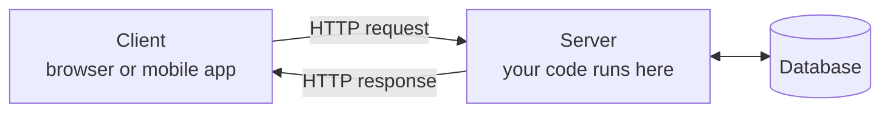

---


Over the next few weeks you go from — quite possibly — never having written a line of Django, to
putting a real application on the internet: one with user accounts, a database behind it, an admin
screen, two languages, and enough security to survive being public.

Not a tutorial you follow once and forget. **One application, built together, across
all six units** — and in Unit 6 you deploy it and send someone the link.

!!! quote "The one thing to know on day one"

    You will be confused, and you will break things. Both are the job, not a failure at it.
    We debug in front of everyone, and the person asking the "obvious" question is doing the
    whole room a favour.

Bring a laptop and your questions. Let's build something.

→ [Unit 1 — Class Slides](unit-1/slides.md)

---

## What Is Web Technology?

Every web page you have ever opened is the same conversation, repeated:



**Web technology** is the stack of standards and tools that makes that exchange work — HTTP as the
protocol, HTML, CSS and JavaScript on the client, and a server that decides what to send back.

- **Front end** — what runs in the browser: structure (HTML), presentation (CSS), behaviour (JS)
- **Back end** — what runs on the server: routing, logic, data, authentication
- **Between them** — HTTP, which is **stateless**: the server forgets you the moment it replies

Though all three parts play an important role here the last two points cause more of this course. Sessions, cookies, and authentication all exist to work around a protocol with no memory.

---

## From Web Pages to Web Applications

The early web served **files**. Ask for `/about.html` and you get that exact file — the same bytes
for every visitor, every time.

A **web application** builds its response *at the moment you ask for it*:

| | Static site | Web application |
|---|---|---|
| What the server sends | A file from disk | A page assembled per request |
| Same for every visitor? | Yes | No — your data, your language, your permissions |
| Where the content lives | In the file | In a database |
| To change content | Edit and re-upload files | Edit data, usually through an admin screen |

Everything that makes an application *an application* — accounts, saved work, permissions, search,
a shopping cart — follows from that one shift: **the page is computed, not stored.**

Writing that computation is the back end's job, and it is what this course teaches.

---

## Why Learn Web Development?

Almost everything an organisation does now happens partly through a browser.

- **Low Barrier to Entry** - no need of years of costly schooling, a computer and an internet connection is enough to get started
- **Empowertment for your own projects** - build your own web apps, automate taks, bring your own unique ideas to life
- **Shortest path from idea to users** — think of it on Tuesday, strangers use it by the weekend
- **In demand** — portable, remote-friendly, and priced accordingly

Learn how a request becomes a response and you can pick up the next framework in a week.

---

## Why a Framework?

You *can* build a web application with nothing but Python's standard library. People did. It taught
them a great deal and shipped very slowly.

| Without a framework | With Django |
|---|---|
| Hand-write SQL, escape every input yourself | An ORM that parameterises queries by default |
| Build a login system, hash passwords, hope | A tested authentication and permissions system |
| Write a CRUD back-office for every model | An admin site generated from your models |
| Meet CSRF and XSS the hard way, in production | Protection on before you write any code |

---

## Conventions Are the Hidden Feature

The most valuable thing a framework gives you is the least advertised: **one conventional structure
that other developers already read fluently.**

- A stranger opens `models.py` and knows what is inside it
- Your code becomes reviewable
- Stack Overflow(ChatGPT, Gemini these days!) answers apply to *your* situation

Invent your own layout and you give away all three.

---

## How to Learn a Framework Well

1. **Master the language underneath first.** Django is Python.
2. **Learn the *how* behind the magic.** Anything that works when you cannot say why is a debt.
   We pay those down: what `makemigrations` writes, how the template loader searches, what
   middleware actually wraps.
3. **Build real projects.** Reading about forms teaches you form syntax. A form rejecting a real
   user's bad input teaches you forms.

---

## Checkpoint — Frameworks

??? question "Name one thing a framework gives you that is not a feature."

    Conventions. A shared project structure is what makes your code reviewable by strangers, and
    what makes other people's answers apply to your problem.

??? question "You copy a tutorial, it works, and you cannot explain why. What have you gained?"

    A working page and a debt. It comes due the first time it breaks.

---

## What Is Django?

!!! quote "Django's own tagline"

    *The web framework for perfectionists with deadlines.*

A high-level web framework written in Python. The trade it offers is explicit:

- **You accept** a set of opinions about how a web application should be structured
- **You get** an enormous amount of finished, tested, secured machinery

---

## Where Django Came From

Built around **2003** in the newsroom of the *Lawrence Journal-World*, a local newspaper in
Lawrence, Kansas, by **Adrian Holovaty** and **Simon Willison**.

- Open-sourced **July 2005**
- Named after the jazz guitarist **Django Reinhardt**
- Governance passed to the non-profit **Django Software Foundation** in 2008

---

## Going Deeper on the Framework

The rest of the Django story — what actually ships in the box, one request traced end to end,
where Django runs in production, when it is the *wrong* tool, and which version to install — lives
in the Unit 1 topic note.

→ [Introduction to Django](unit-1/introduction-to-django.md)

We come back to it properly in Unit 1. For the rest of this session: how the course runs.

---

## Your Learning Journey


---

## What You Will Be Able to Do


Not *understand* authentication — **implement** it.

---

## How This Class Will Be Run

**What to expect** — a hands-on course: clear lectures on the core concepts, live demonstrations,
hands-on labs and coding sessions.


And, **one project we build together from start to finish**!

---

## We Are Building a Real Project

Not isolated topics left isolated. One complete web application, built from scratch —
**`geetshala`**, a Nepali song and lyrics library.

| Unit | What gets added to the project |
|---|---|
| 1 | Project skeleton, first pages, templates |
| 2 | Database models, the admin site, forms |
| 3 | Class-based views, CSV and PDF export, feeds and sitemaps |
| 4 | User accounts, login, permissions, caching |
| 5 | Custom middleware, a customised admin |
| 6 | Nepali/English translation, security hardening, deployment |

One project across the whole course is how you see the pieces connect in context.


---

## Interactive Code-Alongs


---

## Making It Stick

**Mini-challenges.** After a new concept, a five-minute challenge — *"we just learned model
filtering; how would you query all songs published in the last 7 days?"* Apply it while it is warm.

**Code reviews.** Submit a piece of your homework or project code and we run a few constructive
reviews as a class. Reading other people's code is an underrated way to improve your own.

You will also meet `??? question` checkpoints throughout the slides — try to answer before you
expand them.


---

## Your Toolkit

| Tool | What you need | Why |
|---|---|---|
| **Python** | 3.10 or newer | Django is Python; virtual environments keep projects clean |
| **Django** | Current LTS, via `pip` | The subject of the course |
| **Editor** | VS Code, PyCharm, Sublime | Any modern one is fine |
| **Terminal** | Your shell | `pip`, `manage.py`, and everything else |
| **Git & GitHub** | Latest | Version control; we save and track our work |
| **Database** | MySQL or PostgreSQL | Unit 2 onward runs against a real server |


---

## Let's Set It Up


Run all four before the next class. Anything that errors is what we sort out first.

```bash
python --version      # expect 3.10 or newer
pip --version
git --version
mysql -u root -p      # or: psql -U postgres
```

---


## Before Next Class

- [ ] Python 3.10+ installed, `python --version` works
- [ ] Git installed, `git --version` works
- [ ] MySQL or PostgreSQL running, and you can log into its shell
- [ ] GitHub repository created and cloned locally
- [ ] Skim [Unit 1 — Class Slides](unit-1/slides.md)

Bring the errors you hit. They are the first thing we fix.

---

## Exit Questions

??? question "In one sentence: what does Django give you that Python alone does not?"

    Finished, tested, secured answers to the problems every web application has — plus conventions
    other developers already read fluently.

??? question "Why does a web framework ship with an admin interface at all?"

    Because it was built in a newsroom, where non-programmer journalists had to enter the content
    themselves. The constraint became a feature.

??? question "What is the first thing to do before the next class?"

    Verify Python, Git, and the database server, and create the GitHub repository.
