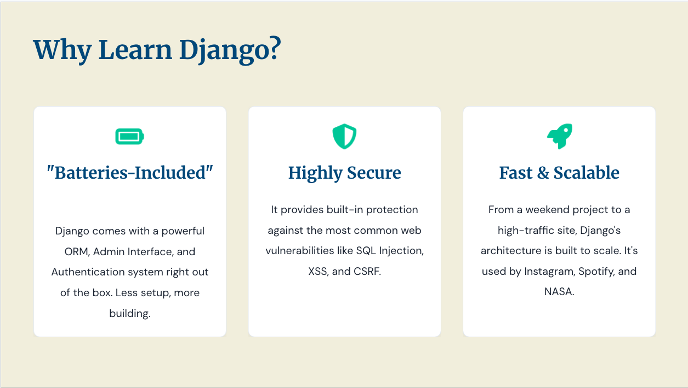
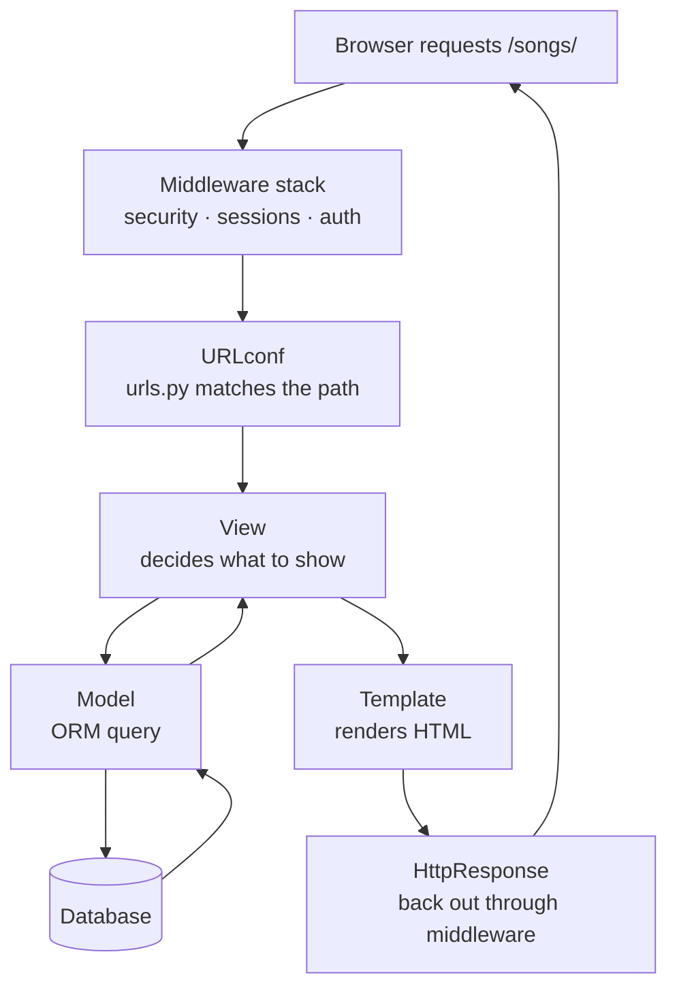

# Introduction to Django

## What is Django? - Web Framework

- A toolkit to simplify web development
- pre-built components and tools, and a standardized way of building web applications
- ability to build applications faster and more efficiently
- no need to reinvent the wheel for common tasks

!!! quote "Django's own tagline"

    *The web framework for perfectionists with deadlines.*

---

## What comes with Django

### "Batteries Included" — What Is Actually in the Box

The phrase gets repeated until it stops meaning anything. Concretely, here is what ships in the
box, and where in this course you meet each one:

| What you get | What it replaces | Unit |
|---|---|---|
| **ORM** | Hand-written SQL | [2](../unit-2/slides.md) |
| **Migrations** | Manual `ALTER TABLE` scripts | [2](../unit-2/slides.md) |
| **Admin site** | A back-office app you'd build yourself | [2](../unit-2/slides.md) · [5](../unit-5/slides.md) |
| **Forms** | Manual parsing and error handling | [2](../unit-2/slides.md) |
| **Template engine** | String formatting | [1](../unit-1/slides.md) · [3](../unit-3/slides.md) |
| **Generic views** | The same view logic, written five times | [3](../unit-3/slides.md) |
| **Auth** | A login system and a security incident | [4](../unit-4/slides.md) |
| **Sessions · cache** | Bespoke state and caching, usually wrong | [4](../unit-4/slides.md) |
| **Middleware** | Copy-pasted setup in every view | [4](../unit-4/slides.md) · [5](../unit-5/slides.md) |
| **Security defaults** | Meeting each vulnerability via an attacker | [4](../unit-4/slides.md) · [6](../unit-6/slides.md) |
| **i18n / l10n** | A rewrite once you need a second language | [6](../unit-6/slides.md) |

Every left-hand item is code you did not write, did not test, and did not have to secure.

---

## Why Use Django?

- **Rapid Development**: Django's built-in features and tools allow developers to build applications quickly, reducing development time significantly.
- **Scalability**: Django is designed to handle high-traffic applications and can scale easily as your application grows.
- **Security**: Django includes built-in security features to protect against common web vulnerabilities, such as SQL injection, cross-site scripting (XSS), and cross-site request forgery (CSRF).
- **Versatility**: Django can be used to build a wide range of applications, from simple websites to complex web applications and APIs.
- **Community and Ecosystem**: Django has a large and active community, which means there are plenty of resources, third-party packages, and plugins available to extend its functionality.
- **Maintainability**: Django's emphasis on clean and reusable code makes it easier to maintain and update applications over time.

---

## One Request, End to End

`GET /songs/`:

→ Step by step, with the class:
[How Django processes a request](./slides.md#15-how-django-processes-a-request)

---

## Where Each Piece Is Taught

The diagram above doubles as a course map — each unit fills in more of it:

| Unit | What it adds to the picture |
|---|---|
| 1 | URLconf → View → Template |
| 2 | The Model, and the database underneath it |
| 3 | Far more from the View and Template layers, with less code |
| 4 | The middleware stack — sessions, auth, caching |
| 5 | Middleware opened up, so you write your own |
| 6 | A real server, in more than one language, safely |

---

## Checkpoint — The Request Path

??? question "Does `urls.py` run before or after middleware?"

    After. Middleware wraps the whole thing — the URLconf only runs once the request has passed
    inward through the stack.

??? question "Which two layers does the view sit between?"

    The model (where the data comes from) and the template (where it gets rendered).

---

## Django in Production

Nothing about Django caps you at small projects.

- **Instagram** — the best-documented case; Django at hundreds of millions of users
- **Mozilla**, **Spotify**, **Disqus**, **National Geographic**, **NASA** — all shipped Django

Stacks evolve, so any given company's may have changed since it was last written about.

!!! tip "The honest scaling story"

    Django is rarely the bottleneck — the database usually is. That is why Unit 4's caching and
    query optimisation, and Unit 6's shared-nothing architecture, matter more to performance than
    the framework choice does.

---

## When Django Is *Not* the Right Tool

A course that only sells you its subject is not teaching engineering judgement.

- **One tiny endpoint** — a webhook receiver needs no ORM, template engine, or admin site.
  Flask or FastAPI is less code and less to reason about.
- **Async-first, long-lived connections** — Django has real async support, but if your application
  fundamentally *is* websockets and streaming, FastAPI or Starlette fit more naturally.
- **Non-relational data** — the ORM, migrations, and admin all assume a relational database. Point
  it at a document or graph store and you give up most of what you came for.
- **You want to assemble your own stack** — Django's opinions *are* the product.

Not on that list: *"it's just an API, no HTML."* That is Django REST Framework territory, and a
very good use of Django.

---

## Checkpoint — Judgement

??? question "Give one honest reason *not* to use Django."

    - a single tiny endpoint; 
    - an async-first websocket application; 
    - non-relational data; or
    - wanting to choose every layer of the stack yourself.

??? question "Your Django site is slow. What is the most likely culprit?"

    The database — query patterns, missing indexes, N+1 queries. Rarely the framework itself.

---
