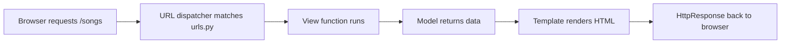

# Unit 1 — Django Basics

---

## 1. Where We Are Going

The whole unit in one line: **a URL comes in, a view runs, a template renders, HTML goes out.**

- Understand what a framework buys you
- Stand up a real project — `geetshala`
- Follow one request end to end
- Render dynamic pages without repeating yourself

!!! tip "Prerequisite check"

    - Python 3.10+ 
    - virtual environments 
    - basic HTTP (GET/POST, status codes) 
    - relational DB basics

---

## 2. Learning Outcomes

By the end of this unit you can:

1. Explain what a web framework provides, and why **loose coupling** is a first-class goal
2. Distinguish **MVC** from Django's **MTV**, and name who does what
3. Create a project + app, configure a database, run the dev server
4. Trace an HTTP request through Django's pipeline
5. Map URLs to views, including **dynamic (captured)** parameters, and handle **404s**
6. Render dynamic content with tags, filters, template loading, and inheritance

---

## 3. What Is a Web Framework?

- A **toolkit** that simplifies web development
- Pre-built components + a standardized way to build applications
- Build faster and more efficiently
- **Don't reinvent the wheel** for common tasks — routing, forms, auth, admin, ORM

??? tip "Ask the class: name three things every web app needs"
    - Routing, 
    - templating, 
    - database access, 
    - forms/validation, 
    - authentication, sessions,
    - security defenses, 
    - static file handling, admin tooling. 

→ [Introduction to Django](introduction-to-django.md)

---

## 4. What Comes with Django


"Batteries included" — the ORM, template engine, admin site, forms, auth and security
layers all ship in the box.

---

## 5. Why Use Django?

| Reason | What it means for you |
|---|---|
| **Rapid Development** | Built-in features cut development time significantly |
| **Scalability** | Designed for high-traffic apps; scales as the app grows |
| **Security** | Built-in defenses against SQL injection, XSS, CSRF |
| **Versatility** | Simple sites → complex apps → APIs |
| **Community & Ecosystem** | Large active community, third-party packages, plugins |
| **Maintainability** | Clean, reusable code is easier to maintain and update |

---

## 6. Architectural Pattern: MVC

- A software design pattern for developing web applications
- Three components: **Model**, **View**, **Controller**
- Separates *data*, *presentation*, and *control flow* so each can change independently

---

## 7. Django's Take: MTV

Django's **Model–Template–View** is a variation of MVC:

| Layer | Role | `geetshala` example |
|---|---|---|
| **Model (M)** | Data layer — data and database interactions | Artists, Albums, Songs |
| **View (V)** | Business logic — handles the request, talks to the model, picks a template | List songs, show one song, process a form |
| **Template (T)** | Presentation — the user interface | Different components for logged-in vs anonymous users |

??? tip "Ask the class: so where is the 'Controller'?"

    Django itself is the controller — the framework's URL dispatcher decides which view runs.
    That is why Django calls the pattern MTV rather than MVC.

---

## 8. DRY — Don't Repeat Yourself

- Every piece of knowledge must have a **single, unambiguous, authoritative representation** in a system
- Aimed at reducing repetition and promoting reusability

**DRY in Django**

- Reusable components: models, views, templates
- One template for Artist information, reused across views
- **Template inheritance** — a base template extended by specific pages

---

## 9. Project vs App

A **Project** is the entire web application; an **App** is a modular component serving one function.

!!! example "The shopping mall analogy"

    | Component | Django equivalent | Description |
    |---|---|---|
    | The Shopping Mall | **Project** | The entire website; holds configuration that applies to everything |
    | Individual Store | **App** | A self-contained feature — Users, Albums, Artists |
    | Mall Directory | `urls.py` | The routing map that sends a visitor to the right store |
    | Mall Rules / Lease | `settings.py` | Core configuration (database, security, time zone) all stores follow |

**Project**: configuration hub · single entry point · one per deployed site · owns `manage.py`
**App**: one specific job · own models/views/templates · reusable · own `urls.py`

**Flow:** Request arrives → **Project routes** → **App handles** → App executes

??? tip "Ask the class: which apps would Geetshala need?"

    `users`, `artists`, `songs`, `playlists`, `reviews`, `api`

→ [Project and App structure](project-and-app-structure.md)

---

## 10. Setup — Live Along

```bash
python3 -m venv myenv
source myenv/bin/activate        # Windows: myenv\Scripts\activate
pip install django
django-admin --version           # verify
```

A **virtual environment** is an isolated Python environment, so dependencies for different
projects never conflict. Commands installed inside it are available only inside it.

→ [Virtual environments](virtual-environment.md)

---

## 11. Starting the Project

```bash
django-admin startproject geetshala
cd geetshala
python manage.py runserver
```


The rocket means the install works — nothing about *your* app yet.

??? tip "Let the world know what you have built"

    ```bash
    git init
    git add .
    git commit -m "Initial commit"
    ```

→ [Full setup walkthrough](project-setup.md#getting-started-with-django)

---

## 12. Anatomy of the Project

```plaintext
geetshala/            ← project root (just a folder)
    manage.py         ← CLI entry point for this project
    geetshala/        ← the Python package (import as geetshala.settings)
        __init__.py   ← marks the directory as a package
        settings.py   ← configuration for the whole project
        urls.py       ← the site's "table of contents"
        wsgi.py       ← entry point for WSGI servers
        asgi.py       ← entry point for ASGI servers
```

??? tip "Ask the class: why two folders with the same name?"

    The outer one is just a container you can rename freely; the inner one is the
    importable Python package, so renaming it breaks `geetshala.settings`.

---

## 13. The Default Database

- Django ships with **SQLite** — lightweight, file-based, minimal setup
- Good for development and small-scale applications

??? tip "Ask the class: where is SQLite configured, and where does the file live?"

    Configured in the `DATABASES` setting in `settings.py`; the file is `db.sqlite3`
    in the project root by default.

*A separate MySQL/PostgreSQL setup comes in Unit 2.*

---

## 14. Dynamic Pages, Dynamic Content

| Static pages | Dynamic pages |
|---|---|
| Same content for every user | Content changes with user, interaction, preferences |

**Dynamic content** is generated on the fly per request — personalized experiences,
real-time updates, interactive features. Think social feeds, product recommendations, news sites.

The **View** processes the request, retrieves data from the **Model**, and picks the **Template**.

---

## 15. How Django Processes a Request


Walk through `/songs`:



??? tip "Ask the class: name the six steps in order"

    1. User requests `/songs`
    2. Django's URL dispatcher matches the URL to a view
    3. The view retrieves data from the model
    4. The view selects a template and passes the data
    5. The template renders HTML with dynamic content
    6. Django returns the rendered HTML to the browser

---

## 16. When It Goes Wrong


??? tip "Debug drill: 'The requested URL /songs was not found on this server.'"

    - **App registration** — is the app in `INSTALLED_APPS` in `settings.py`?
    - **URL configuration** — is the `/songs` pattern defined in the project or app `urls.py`?
    - **View function** — is it implemented and returning a valid `HttpResponse`?

---

## 17. Anatomy of a URL

```plaintext
scheme://domain:port/path?query_string#fragment_id
```

| Part | Description | Example |
|---|---|---|
| Scheme | Protocol to use | `https://` |
| Hostname | Domain or IP of the server | `www.example.com` |
| Port | Network port (80 HTTP, 443 HTTPS) | `:8000` in development |
| Path | Location of the resource on the server | `/songs/2025/` |
| Query | Extra key-value parameters | `?sort=price&limit=10` |
| Fragment | Section within the resource (never sent to the server) | `#section-header` |

**In Django you define the Path.** For `https://127.0.0.1:8000/songs/2025/` → `/songs/2025/`

---

## 18. URLconfs and Loose Coupling

A URLconf is a Python list named `urlpatterns` containing `path()` definitions.

```python title="geetshala/urls.py — project level"
urlpatterns = [
    path('admin/', admin.site.urls),
    path('songs/', include('songs.urls')),   # hand off to the app
]
```

```python title="songs/urls.py — app level"
urlpatterns = [
    path('', views.song_list, name='song_list'),                 # /songs/
    path('<int:song_id>/', views.song_detail, name='song_detail'),  # /songs/1/
]
```

**Loose coupling** — URLs are decoupled from view logic, so either side can change alone:

- Point `/songs/123/` at a maintenance page without touching the URL structure
- Rename `/songs/123/` to `/geet/123/` without touching the view

---

## 19. Dynamic URLs

One pattern, many requests — the URL captures a variable part and passes it as an argument.

```python title="songs/urls.py"
path('<int:song_id>/', views.song_detail, name='detail')
```

```python title="songs/views.py"
def song_detail(request, song_id):
    return HttpResponse(f"You are viewing Song ID: {song_id}")
```

Visiting `/songs/543/` makes Django call `song_detail(request, song_id=543)`.

---

## 20. 404s and Django's Pretty Error Page

**404 — Page Not Found:** the requested URL does not exist. Check URL resolution, view logic,
or supply a custom page via `handler404`.

```python title="geetshala/urls.py"
handler404 = 'geetshala.views.custom_404_view'
```

```python title="geetshala/views.py"
def custom_404_view(request, exception):
    return HttpResponse("Custom 404 - Trying to render a page", status=404)
```

**Pretty error page** (only when `DEBUG = True`): stack trace · code context ·
variable inspection · request information · settings overview.

!!! warning "In production"

    Those pages leak sensitive information. Set `DEBUG = False` — Django then returns a
    generic HTTP 500 page and logs the detail internally.

---

## 21. The Django Template System

- Django's built-in mechanism for generating HTML, XML, or other text formats
- Separates **how data looks** from **how data is processed** — the MTV split
- Templates are `.html` files: static markup + dynamic placeholders

**Where templates live**

- `templates/` inside each app (default), or
- one global project-level `templates/` directory registered in `settings.py`:

```python
TEMPLATES = [{ ..., 'DIRS': [BASE_DIR / 'templates'], ... }]
```

---

## 22. Variables, Tags, Filters

**Variables** — `{{ ... }}` placeholders for dynamic content:

```html
<h1>{{ song.title }}</h1>
<p>Artist: {{ song.artist.name }}</p>
```

**Tags** — control flow and framework hooks:

| Tag | Purpose |
|---|---|
| `` | Conditional statements |
| `` | Loop over iterables |
| `` | Security tag — required in every POST form |
| `` | Look up a URL by name instead of hardcoding it |

**Filters** — modify how a value displays, applied with `|`:

`{{ song.release_date|date:"F j, Y" }}` · `{{ name|default:"Anonymous" }}` ·
`{{ comments|length }}` · `{{ html_content|safe }}`

→ [Tags and filters in detail](project-setup.md#basic-template-tags-and-filters)

---

## 23. Templates in Views

??? tip "Ask the class: what exactly does a View do?"

    Processes the request → retrieves data from the Model → tells Django to render
    the appropriate Template with that data.

```python title="The render() shortcut"
def song_list(request):
    songs = Song.objects.all()
    return render(request, 'songs/song_list.html', {'songs': songs})
```

`render(request, template_name, context=None, ...)` combines a template with a context
dictionary and returns an `HttpResponse`.

```python title="Under the hood — manual rendering"
template = loader.get_template('songs/song_list.html')
return HttpResponse(template.render({'songs': songs}, request))
```

---

## 24. Template Loading

How Django finds `'songs/song_list.html'`:

1. Check the `TEMPLATES` setting for directories to search (`DIRS`)
2. Search each app's `templates/` directory when `APP_DIRS` is `True`
3. Load the first match — otherwise raise `TemplateDoesNotExist`

```python
TEMPLATES = [{ ..., 'APP_DIRS': True, ... }]
```

!!! tip "Namespace your templates"

    `songs/templates/songs/song_list.html` — the repeated app name prevents two apps
    from shadowing each other's `song_list.html`.

---

## 25. Template Inheritance — DRY in Action

Define common elements once in a base template; children fill in the blocks.

```html title="base.html"
<title>Welcome to Geetshala</title>
<main>
  
</main>
```

```html title="child.html"

Home - Geetshala

  <h2>List of Songs</h2>

```

Header, nav, and footer are written **once** — every page inherits them.

---

## 26. Lab Checklist

Students should leave the session having done all of this:

- [ ] Create and activate a virtual environment; install Django
- [ ] `startproject geetshala`; run the dev server and reach the welcome page
- [ ] Create the `songs` app and register it in `INSTALLED_APPS`
- [ ] Wire project `urls.py` → app `urls.py` with `include()`
- [ ] Write `song_list` and `song_detail` views; make `/songs/1/` work
- [ ] Build `base.html` and extend it from `song_list.html`
- [ ] Trigger a 404 and a `DEBUG = True` error page on purpose, and read them
- [ ] Commit the work to Git

---

## 27. Recap

- A framework gives you the common parts; **loose coupling** keeps them replaceable
- **MTV**: Model = data, Template = presentation, View = logic — Django is the controller
- **Project** = configuration and routing; **App** = one reusable feature
- A request flows **URL → URLconf → view → model → template → response**
- `DEBUG = True` is a development luxury and a production hazard
- **DRY** shows up concretely as template inheritance and the `` tag

---

## 28. Exit Questions

??? question "Why does Django call it MTV instead of MVC?"

    The framework's URL dispatcher plays the controller role, so the pattern's three
    author-written pieces are Model, Template, and View.

??? question "What breaks if you rename the *inner* `geetshala/` directory?"

    Every dotted path that imports it — `geetshala.settings`, `geetshala.wsgi` —
    including `DJANGO_SETTINGS_MODULE` and `ROOT_URLCONF`.

??? question "`/songs/` returns 404 but the view exists. Name three things to check."

    App in `INSTALLED_APPS`; URL pattern present and `include()`d from the project URLconf;
    the view actually returns an `HttpResponse`.

??? question "Give one concrete benefit of loose coupling between URLs and views."

    You can change `/songs/123/` to `/geet/123/`, or route it to a maintenance page,
    without editing the view logic at all.

??? question "Where would you put markup that appears on every page?"

    In `base.html`, inside blocks that child templates extend — never copied per page.
---